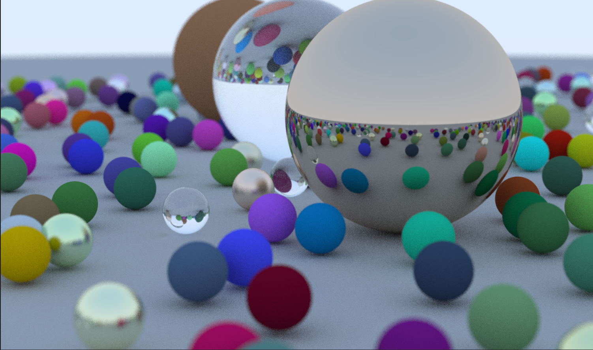

# Tinyraytracer

### Raytracing in one week
2023.5.30 - 2023.6.03

**Running command**:
> cmake -B build ; cmake --bulid build

**To do**:
- [x] output .ppm image
- [x] Antialiasing
- [x] Materials: Diffuse, Metal, Dielectrics
- [x] Camera: Defocus Blur

**code lines**:
> find . "(" -name "*.cpp" -o -name "*.hpp" ")" -print | xargs wc -l

834 total

**file structure**:
> tree /f
```
└─src
    ├─core
    │      camera.cpp
    │      camera.hpp
    │      material.cpp
    │      material.hpp
    │      object.cpp
    │      object.hpp
    │      ray_tracer.cpp
    │      ray_tracer.hpp
    │      scene.cpp
    │      scene.hpp
    │
    ├─main
    │      main.cpp
    │
    ├─material
    │      dielectric.cpp
    │      dielectric.hpp
    │      lambertian.cpp
    │      lambertian.hpp
    │      metal.cpp
    │      metal.hpp
    │
    ├─math
    │      constant.cpp
    │      ray.hpp
    │      vec3.cpp
    │      vec3.hpp
    │
    ├─object
    │      sphere.cpp
    │      sphere.hpp
    │
    └─utility
            intersection.cpp
            intersection.hpp
```    

**display**:


### Reference

- [Ray Tracing in One Weekend](https://raytracing.github.io/books/RayTracingInOneWeekend.html)
- [如何开始用 C++ 写一个光栅化渲染器？ - UncP的回答 - 知乎](https://www.zhihu.com/question/24786878/answer/127484388)
